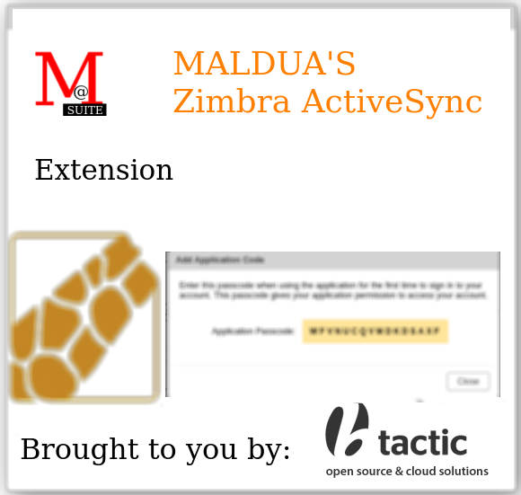

# Maldua's Zimbra ActiveSync



## About

**MALDUA'S Zimbra ActiveSync Extension** brought to you by [BTACTIC, open source & cloud solutions](https://www.btactic.com).

ActiveSync is a mobile data synchronization app developed by Microsoft, originally released in 1996. It synchronizes data with handheld devices and desktop computers.

This ActiveSync helper will improve integration with [Z-Push](https://github.com/Z-Hub/Z-Push/) and [Z-Push Zimbra Backend](https://sourceforge.net/projects/zimbrabackend/).

Please notice that **it does not bring an equivalent functionality to an ActiveSync server on its own.**

## Supported Zimbra versions

- Zimbra 10.1.x

## Requisites

- This project assumes that you already have a VPS with Z-Push server and Z-Push Backend for Zimbra properly setup. That VPS should already be able to handle ActiveSync connections from your ActiveSync clients to your Zimbra non 2FA enabled accounts.

## Also check

The companion project that adds Two-Factor authentication for Zimbra FOSS: [Maldua's Zimbra 2FA](https://github.com/maldua-suite/zimbra-maldua-2fa).

## Features

### 2FA Application Passcodes now work

Thanks to the new soap request page:

- Application Passcodes work as expected when 2FA is enabled for them.
- Non 2FA enabled accounts also login properly.

### zimbraHttpThrottleSafeIPs security filter

- Only allow connections from **zimbraHttpThrottleSafeIPs** ips by default for an increased security.

### Logins logging in audit.log

ActiveSync logins are now logged in audit.log file.

```
2025-09-19 19:40:17,304 INFO  [qtp1279309678-18:https://zimbra.example.net/service/soap/] [name=login@example.net;oip=1.2.3.4, 5.6.7.8;port=47834;ua=BlueMail 1.140.103 (20466)(...le2bw6) devip=1.2.3.4 ZPZB/74;soapId=56847ec2;] security - cmd=Auth; account=login@example.net; protocol=zsync;
```

## Admin documentation

### Initial setup (Zimbra)

Before even installing this extension you need to whitelist your ActiveSync server (Usually Z-Push + Z-Push Backend for Zimbra) ip into **zimbraHttpThrottleSafeIPs**.
Let's assume that your Z-Push server ip seen by Zimbra is 1.2.3.4.

This should always work:
```
sudo su - zimbra
zmprov modifyServer $(zmhostname) +zimbraHttpThrottleSafeIPs '1.2.3.4'
exit
```
.

If you want something that works in all of your cluster nodes at once use this instead:

```
sudo su - zimbra
zmprov mcf +zimbraHttpThrottleSafeIPs '1.2.3.4'
exit
```

### Initial setup (Z-Push VPS)

Your existing Z-Push + Z-Push Backend for Zimbra VPS needs to be patched.

Usually you would need to edit `/usr/share/z-push/backend/zimbra/zimbra.php` file in such a way that around 1000 line:

```php
        $body    = '<AuthRequest xmlns="urn:zimbraAccount">
                        <account by="name">'.$this->_username.'</account>
                        <password>'.$this->_password.'</password>
                        <attrs><attr name="uid"/></attrs>
                        <prefs><pref name="zimbraPrefTimeZoneId"/></prefs>
                    </AuthRequest>';
```

is changed to:

```php
        $body    = '<ZetaActiveSyncAuthRequest xmlns="urn:zimbraAccount">
                        <account by="name">'.$this->_username.'</account>
                        <password>'.$this->_password.'</password>
                        <attrs><attr name="uid"/></attrs>
                        <prefs><pref name="zimbraPrefTimeZoneId"/></prefs>
                    </ZetaActiveSyncAuthRequest>';
```
.

That way the authentication request is no longer done to the usual AuthRequest soap page but to the ZetaActiveSyncAuthRequest soap page.

### Installation

#### Automatic installation

**Notice:** In a Multi-Server cluster these commands have to be run on each one of the mailbox nodes.

```
sudo -i # Become root
cd /tmp
wget 'https://github.com/maldua-suite/zimbra-maldua-activesync/releases/download/v0.1.0/zimbra-maldua-activesync_0.1.0.tar.gz'
tar xzf zimbra-maldua-activesync_0.1.0.tar.gz
cd zimbra-maldua-activesync_0.1.0
```

For regular installation or upgrade you can run:
```
./install.sh
```
instead
.

In order for the two-factor authentication extension and the adminZimlet to apply you need to restart mailboxd with:
```
sudo -i # Become root
su - zimbra -c 'zmmailboxdctl restart'
```

#### Manual installation

**Notice:** In a Multi-Server cluster these commands have to be run on each one of the mailbox nodes.

**WARNING:** Please change **0.1.0** with whatever it's the latest released version.

```
sudo -i # Become root
cd /tmp
wget 'https://github.com/maldua-suite/zimbra-maldua-activesync/releases/download/v0.1.0/zimbra-maldua-activesync_0.1.0.tar.gz'
tar xzf zimbra-maldua-activesync_0.1.0.tar.gz
chown zimbra:zimbra zimbra-maldua-activesync_0.1.0
cd zimbra-maldua-activesync_0.1.0
cp zetaactivesync.jar /opt/zimbra/lib/ext/twofactorauth/zetaactivesync.jar
```

In order for the ActiveSync extension to apply you need to restart mailboxd with:
```
sudo -i # Become root
su - zimbra -c 'zmmailboxdctl restart'
```

### Uninstallation

```
sudo -i # Become root
mv /opt/zimbra/lib/ext/twofactorauth/zetaactivesync.jar /root/zetaactivesync.jar-REMOVED-ON-YYYY-MM-DD
```

In order for the removal to be applied you need to restart mailboxd with:
```
sudo -i # Become root
su - zimbra -c 'zmmailboxdctl restart'
```
.

## Developer documentation

This documentation is aimed at developers, not at admins.

### How to build the extension

- Check: [EXTENSION_BUILD.md](EXTENSION_BUILD.md) on how to build the Extension.

### How to install the extension

- Check: [EXTENSION_INSTALL.md](EXTENSION_INSTALL.md) on how to install the Extension.

### How to release the extension

- Check: [RELEASE.md](RELEASE.md) on how to release the extension.

## Licenses

### License (Extension)

```
Maldua Zimbra ActiveSync Extension
Copyright (C) 2025 BTACTIC, S.C.C.L.

This program is free software: you can redistribute it and/or modify
it under the terms of the GNU General Public License as published by
the Free Software Foundation, either version 2 of the License, or
(at your option) any later version.

This program is distributed in the hope that it will be useful,
but WITHOUT ANY WARRANTY; without even the implied warranty of
MERCHANTABILITY or FITNESS FOR A PARTICULAR PURPOSE.  See the
GNU General Public License for more details.

You should have received a copy of the GNU General Public License
along with this program.  If not, see http://www.gnu.org/licenses/.
```

### License (Administration zimlet)

```
Maldua Zimbra ActiveSync Administration zimlet
Copyright (C) 2025 BTACTIC, S.C.C.L.

This program is free software: you can redistribute it and/or modify
it under the terms of the GNU General Public License as published by
the Free Software Foundation, either version 2 of the License, or
(at your option) any later version.

This program is distributed in the hope that it will be useful,
but WITHOUT ANY WARRANTY; without even the implied warranty of
MERCHANTABILITY or FITNESS FOR A PARTICULAR PURPOSE.  See the
GNU General Public License for more details.

You should have received a copy of the GNU General Public License
along with this program.  If not, see http://www.gnu.org/licenses/.
```
