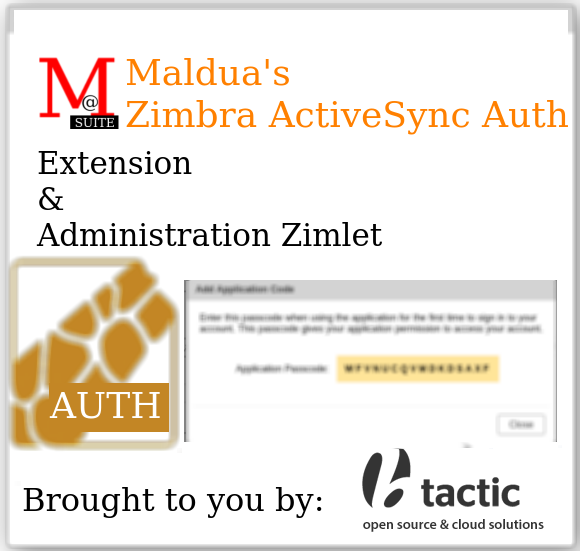

# Maldua's Zimbra ActiveSync Auth



## About

**MALDUA'S Zimbra ActiveSync Auth Extension** brought to you by [BTACTIC, open source & cloud solutions](https://www.btactic.com).

ActiveSync is a mobile data synchronization app developed by Microsoft, originally released in 1996. It synchronizes data with handheld devices and desktop computers.

This ActiveSync Auth extension will improve integration with [Z-Push](https://github.com/Z-Hub/Z-Push/) and [Z-Push Zimbra Backend](https://sourceforge.net/projects/zimbrabackend/).

Please notice that **it does not bring an equivalent functionality to an ActiveSync server on its own.**

## Supported Zimbra versions

- Zimbra 10.1.x

## Requisites

- A VPS with [Z-Push](https://github.com/Z-Hub/Z-Push/) and [Z-Push Zimbra Backend](https://sourceforge.net/projects/zimbrabackend/) properly setup. That VPS should already be able to handle ActiveSync connections from your ActiveSync clients to your Zimbra non 2FA enabled accounts.

## Also check

The companion project that adds Two-Factor authentication for Zimbra FOSS: [Maldua's Zimbra 2FA](https://github.com/maldua-suite/zimbra-maldua-2fa).

## Features

### 2FA Application Passcodes now work

Thanks to the new soap request page:

- Application Passcodes work as expected when 2FA is enabled for them.
- Non 2FA enabled accounts also login properly.

### zimbraHttpThrottleSafeIPs security filter

- Only allow connections from **zimbraHttpThrottleSafeIPs** ips by default for an increased security.

## Admin documentation

### Initial setup (Zimbra) {Step 1 of 3}

Before even installing this extension you need to whitelist your ActiveSync server (Usually Z-Push + Z-Push Backend for Zimbra) ip into **zimbraHttpThrottleSafeIPs**.
Let's assume that your Z-Push server ip seen by Zimbra is 1.2.3.4.

This should always work:
```
sudo su - zimbra
zmprov modifyServer $(zmhostname) +zimbraHttpThrottleSafeIPs '1.2.3.4'
exit
```
.

If you want something that works in all of your cluster nodes at once use this instead:

```
sudo su - zimbra
zmprov mcf +zimbraHttpThrottleSafeIPs '1.2.3.4'
exit
```

### Initial setup (Z-Push VPS) {Step 2 of 3}

Your existing Z-Push + Z-Push Backend for Zimbra VPS needs to be patched.

Usually you would need to edit `/usr/share/z-push/backend/zimbra/zimbra.php` file in such a way that around 1000 line:

```php
        $body    = '<AuthRequest xmlns="urn:zimbraAccount">
                        <account by="name">'.$this->_username.'</account>
                        <password>'.$this->_password.'</password>
                        <attrs><attr name="uid"/></attrs>
                        <prefs><pref name="zimbraPrefTimeZoneId"/></prefs>
                    </AuthRequest>';
```

is changed to:

```php
        $body    = '<ZetaActiveSyncAuthRequest xmlns="urn:zimbraAccount">
                        <account by="name">'.$this->_username.'</account>
                        <password>'.$this->_password.'</password>
                        <attrs><attr name="uid"/></attrs>
                        <prefs><pref name="zimbraPrefTimeZoneId"/></prefs>
                    </ZetaActiveSyncAuthRequest>';
```
.

That way the authentication request is no longer done to the usual AuthRequest soap page but to the ZetaActiveSyncAuthRequest soap page.

### Installation

#### Automatic installation {Step 3 of 3}

**Notice:** In a Multi-Server cluster these commands have to be run on each one of the mailbox nodes.

```
sudo -i # Become root
cd /tmp
wget 'https://github.com/maldua-suite/zimbra-maldua-activesync-auth/releases/download/v0.1.1/zimbra-maldua-activesync-auth_0.1.1.tar.gz'
tar xzf zimbra-maldua-activesync-auth_0.1.1.tar.gz
cd zimbra-maldua-activesync-auth_0.1.1
```

For regular installation or upgrade you can run:
```
./install.sh
```
instead
.

In order for the two-factor authentication extension and the adminZimlet to apply you need to restart mailboxd with:
```
sudo -i # Become root
su - zimbra -c 'zmmailboxdctl restart'
```

#### Manual installation

**Notice:** In a Multi-Server cluster these commands have to be run on each one of the mailbox nodes.

**WARNING:** Please change **0.1.1** with whatever it's the latest released version.

```
sudo -i # Become root
cd /tmp
wget 'https://github.com/maldua-suite/zimbra-maldua-activesync-auth/releases/download/v0.1.1/zimbra-maldua-activesync-auth_0.1.1.tar.gz'
tar xzf zimbra-maldua-activesync-auth_0.1.1.tar.gz
chown zimbra:zimbra zimbra-maldua-activesync-auth_0.1.1
cd zimbra-maldua-activesync-auth_0.1.1
cp zetaactivesyncauth.jar /opt/zimbra/lib/ext/zetaactivesyncauth/zetaactivesyncauth.jar
```

In order for the ActiveSync extension to apply you need to restart mailboxd with:
```
sudo -i # Become root
su - zimbra -c 'zmmailboxdctl restart'
```

### Uninstallation

```
sudo -i # Become root
mv /opt/zimbra/lib/ext/zetaactivesyncauth/zetaactivesyncauth.jar /root/zetaactivesyncauth.jar-REMOVED-ON-YYYY-MM-DD
```

In order for the removal to be applied you need to restart mailboxd with:
```
sudo -i # Become root
su - zimbra -c 'zmmailboxdctl restart'
```
.

## Developer documentation

This documentation is aimed at developers, not at admins.

### How to build the extension

- Check: [EXTENSION_BUILD.md](EXTENSION_BUILD.md) on how to build the Extension.

### How to install the extension

- Check: [EXTENSION_INSTALL.md](EXTENSION_INSTALL.md) on how to install the Extension.

### How to release the extension

- Check: [RELEASE.md](RELEASE.md) on how to release the extension.

## Some background

When [2FA was finally ported to a proper Zimbra Extension for FOSS](https://github.com/maldua-suite/zimbra-maldua-2fa/#some-background) we found out that everything that relied on soap was not going to work seamlessly thanks to Application Passcodes.

The main example was the [Z-Push using Application Passcode is not working as expected](https://github.com/maldua-suite/zimbra-maldua-2fa/issues/7) issue. As you can see in the early days we thought that [AuthMechanism implementation](https://github.com/maldua-suite/zimbra-maldua-2fa/issues/7#issuecomment-1826267239) was the problem.

Later on I offered vincent (the Z-Push Backend for Zimbra) to implement [byPassTwoFactorCode](https://github.com/maldua-suite/zimbra-maldua-2fa/issues/7#issuecomment-2630408402) in zimbra-maldua-2fa itself. I still think that this approach would work if we ever implemented it. It needs a bit of improvement on the Z-Push Backend for Zimbra side so that it can detect when an account has 2FA enabled on it though.

More discussion ensued regarding how this could be implemented in such a way that *Z-Push Backend for Zimbra* didn't have to be rewritten a lot.

In the end [@JimDunphy](https://github.com/JimDunphy) brought up some LLMs to work and started its [zpush-shim](https://github.com/JimDunphy/zpush-shim/) project. I have mixed feelings about it. On the one hand it's a well documented project which would increase *Z-Push Backend for Zimbra* performance while interacting with Zimbra. On the other hand it tries to handle authentication on its own and it reminds on the 'Do not implement your own cryptography' statement. Leave that for the cryptography experts that write libraries you can use. Also it has to modify *Z-Push Backend for Zimbra* a lot. My patch is just changing two words. And I could go on but you get the point. Too much code for my taste.

So after gathering more ideas while interacting with [JimDumphy's zpush-shim Just authenticate with zsync](https://github.com/JimDunphy/zpush-shim/issues/8) issue something clicked on my mind. We could just recreate the [Auth Soap page](https://github.com/JimDunphy/zpush-shim/issues/8#issuecomment-3273889085). This would mean that the useful lines at the extension would be 4 or 5 lines at maximum.

Unfortunately it wasn't so easy. First attempts at pushing `proto` value as `zsync` as a part of the context were ignored. Apparently those had to be modified in the ZimbraSoapContext object. Unfortunately that object did not allow for those values to be modified and its class could not be extended because it was final. LLM suggested to use reflection but I am against using reflection by default.

So, in the end I had to recreate Auth class main method and its privated methods so that I could 'edit' it.

It's not pretty but it works.

At this point some more ideas that come to my mind are:

- Removing audit.log logging (*Z-Push Backend for Zimbra* generates too many login entries.).
- Add an admin zimlet that let's you edit the 'Zimbra Mobile Feature Enabled' attribute in both ClassOfService and Account so that it's taken into account.
- Help Z-Push Backend for Zimbra explore the reuse of Zimbra Auth Tokens so that it doesn't need to relogin each time it needs something.
- Port Z-Push as a proper ActiveSync server inside Zimbra (Yeah, probably too much work for what it's worth).

In any case this first version is complete. You can have a working ActiveSync server (Z-Push based) linked to your Zimbra FOSS, enable 2FA, apply this project and then anyone with 2FA enabled can have its Application Passcode working.

## Similar projects

- [zpush-shim](https://github.com/JimDunphy/zpush-shim/). Cross-platform, high-performance Java shim for Z-Push Zimbra backend that provides direct access to Zimbra internal APIs, bypassing SOAP overhead.

## Licenses

### License (Extension)

```
Maldua Zimbra ActiveSync Auth Extension
Copyright (C) 2025 BTACTIC, S.C.C.L.

This program is free software: you can redistribute it and/or modify
it under the terms of the GNU General Public License as published by
the Free Software Foundation, either version 2 of the License, or
(at your option) any later version.

This program is distributed in the hope that it will be useful,
but WITHOUT ANY WARRANTY; without even the implied warranty of
MERCHANTABILITY or FITNESS FOR A PARTICULAR PURPOSE.  See the
GNU General Public License for more details.

You should have received a copy of the GNU General Public License
along with this program.  If not, see http://www.gnu.org/licenses/.
```

### License (Administration zimlet)

```
Maldua Zimbra ActiveSync Auth Administration zimlet
Copyright (C) 2025 BTACTIC, S.C.C.L.

This program is free software: you can redistribute it and/or modify
it under the terms of the GNU General Public License as published by
the Free Software Foundation, either version 2 of the License, or
(at your option) any later version.

This program is distributed in the hope that it will be useful,
but WITHOUT ANY WARRANTY; without even the implied warranty of
MERCHANTABILITY or FITNESS FOR A PARTICULAR PURPOSE.  See the
GNU General Public License for more details.

You should have received a copy of the GNU General Public License
along with this program.  If not, see http://www.gnu.org/licenses/.
```
